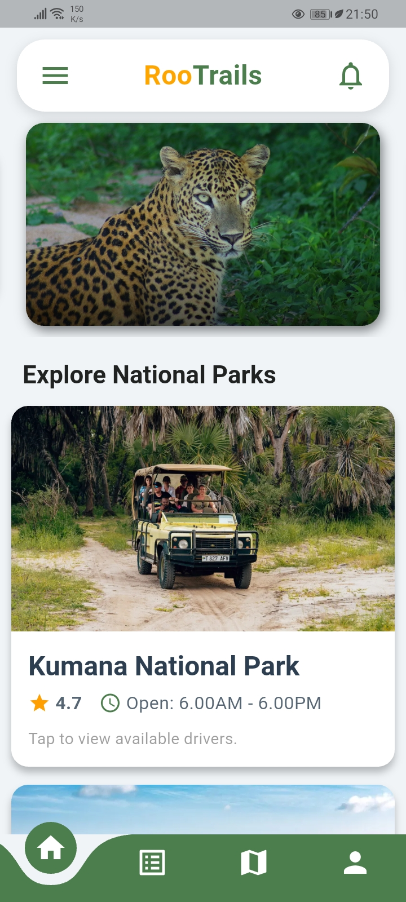
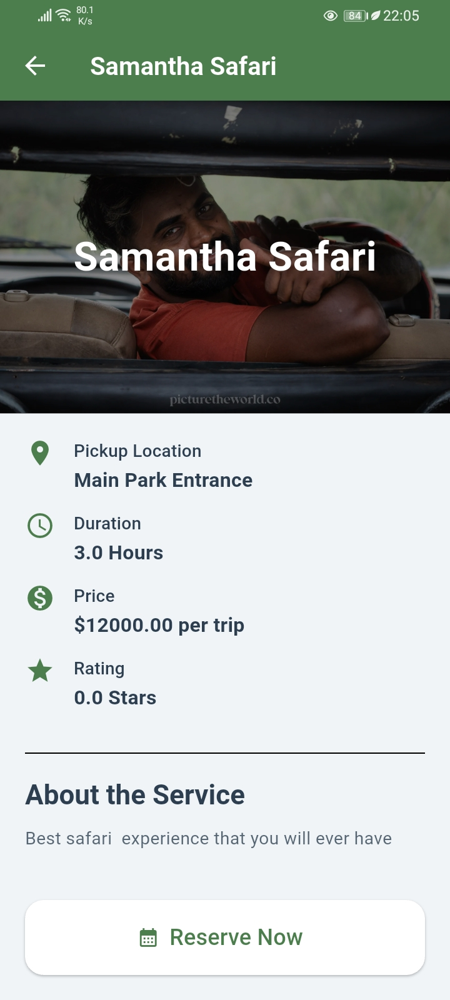
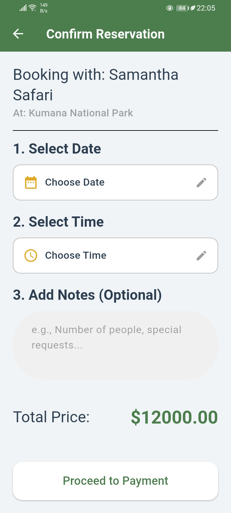
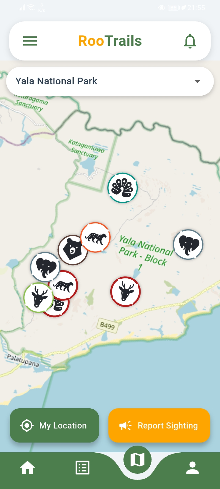
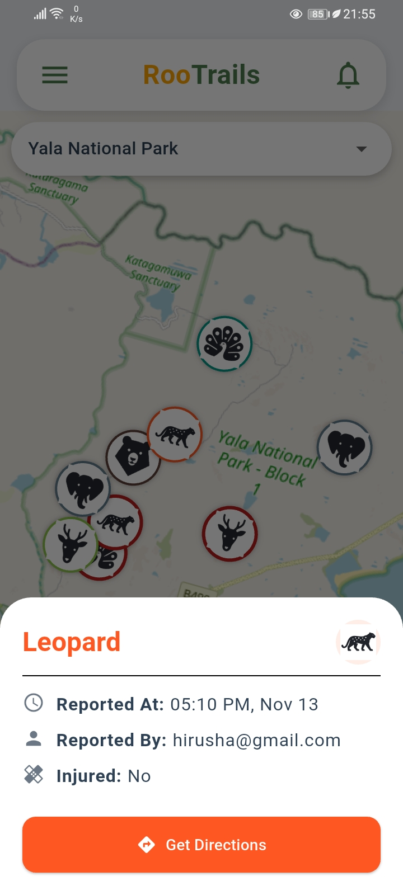
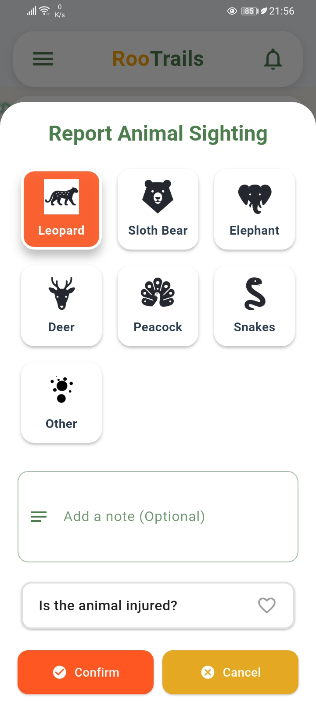
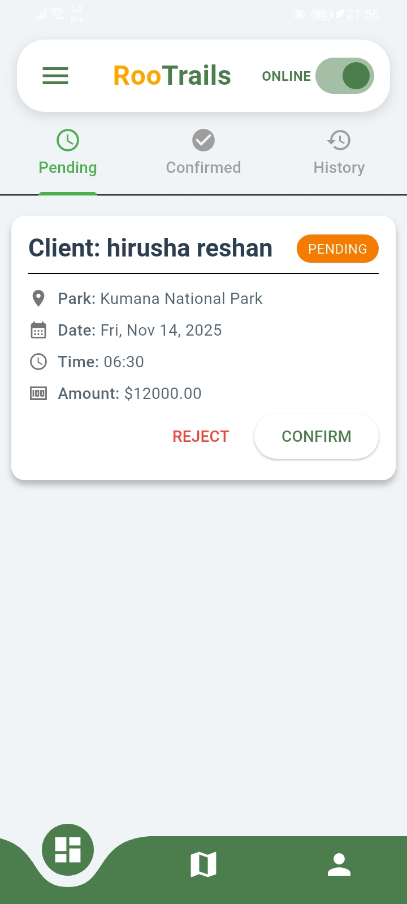

# RooTrails: Sri Lanka Wildlife Safari Tracker

> **RooTrails** is an innovative mobile platform designed to revolutionize the wildlife safari experience in Sri Lanka by connecting travelers and verified safari drivers in real-time.

---

## Meet the RooTrails Team

RooTrails was developed as a collaborative effort between Computer Science and Business students.

| Name | Role | Contact |
| :--- | :--- | :--- |
| **Hirusha Reshan** | Lead Flutter Developer, Firebase Integration , Mapping Logic| [LinkedIn Profile](https://www.linkedin.com/in/hirusha-reshan-425930365/) |
| **Abhiman Theeksana** | Flutter Developer, Firebase Integration , Mapping Logic | [LinkedIn Profile](https://www.linkedin.com/in/abhiman-theekshana/) |
| **Seneesa Thiyumini** | UX/UI Design, Mapping Logic Reasoning | [LinkedIn Profile](https://www.linkedin.com/in/seneesa-karunathilake-aa050b25b/) |
| **Dewshi Chamathka** | Business Strategy & Market Analysis ,  Project Management, Value Proposition  | [LinkedIn Profile](https://www.linkedin.com/in/dewshi-angammana-028921384/) |
| **Aqeela Ashger Ali** | Business Strategy & Market Analysis , Project Management, Value Proposition | [LinkedIn Profile](https://www.linkedin.com/in/aqeela-ashger-ali-9918512b2/) |

## Key Features & Screenshots

RooTrails enhances your safari experience with smart technology and transparency.

<table>
  <tr>
    <td align="center">
      <h2>User</h2><h3> Home Page</h3>
    </td>
     <td align="center">
      <h2>User</h2><h3> My List Page</h3>
    </td>
  </tr>
    <tr>
    <td align="center">
      <p>User Home Page Where you can see the parks and current Events</p>
    </td>
      <td align="center">
      <p>Where you can see and manage your Current Bookings and see Past Bookings</p>
    </td>
    </tr>
  <tr>
    <td align="center">
      
    </td>
    <td align="center">
      
    </td>
    <tr>
      <td></td>
    </tr>
    <tr>
    <td align="center">
      <h2>User</h2><h3> Driver's Details</h3>
    </td>
    <td align="center">
      <h2>User</h2><h3>Reservation Page</h3>
    </td>
  </tr>
    <tr>
    <td align="center">
      <p>Book your Driver and Check Their Details</p>
    </td>
      <td align="center">
      <p>Reserve your Booking after selecting a Date and Time</p>
    </td>
    </tr>
  <tr>
    <td align="center">
      
    </td>
    <td align="center">
      
    </td>
  <tr>
      <td></td>
    </tr>
  <tr>
    <td align="center">
      <h3> Navigation Page</h3>
    </td>
     <td align="center">
      <h3> Sighting Details</h3>
    </td>
  </tr>
    <tr>
    <td align="center">
      <p>Where You can see Heat Maps of the Animals</p>
    </td>
    <td align="center">
      <p>You can see Animal Sighting Details ( Improved Version Coming Soon.. )</p>
    </td>
    </tr>
  <tr>
    <td align="center">
      
    </td>
    <td align="center">
      
    </td>
      <tr>
      <td></td>
    </tr>
  <tr>
    <td align="center">
      <h3> Report Sightings</h3>
    </td>
    <td align="center">
      <h2>Business</h2><h3> Home Page</h3>
    </td>
  </tr>
    <tr>
    <td align="center">
      <p>Report Animal Sightings</p>
    </td>
      <td align="center">
      <p>Manage your Business</p>
    </td>
    </tr>
  <tr>
    <td align="center">
      
    </td>
    <td align="center">
      
    </td>
</table>

***

## Getting Started (Mobile)

### Android

1.  Download the latest **`RooTrails_v1.0.0.apk`** from the [Releases page](https://github.com/HirushaReshan/Rootrails/releases).
2.  Install the APK directly on your Android device (you may need to allow installations from unknown sources).

>### iOS

>The iOS version is currently in development/testing. Stay tuned for the official App Store release!

## Tech Stack

* **Framework:** Flutter
* **Language:** Dart
* **Backend:** Firebase (Core, Authentication, Cloud Firestore)
* **Mapping/Location:** Google Maps Flutter, Geolocator, Latlong2

## Building from Source

If you want to contribute or build the app locally, follow these steps:

1.  **Clone the repository:**
    ```bash
    git clone [https://github.com/HirushaReshan/Rootrails.git](https://github.com/HirushaReshan/Rootrails.git)
    cd roootrails
    ```
2.  **Install dependencies:**
    ```bash
    flutter pub get
    ```
3.  **Run the app:**
    ```bash
    flutter run
    ```
    *(Note: You will need to set up your own Firebase configuration files*
